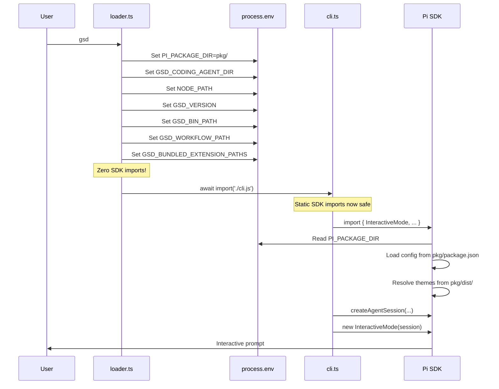

GSD uses a two-file loader pattern to ensure `PI_PACKAGE_DIR` is set before any Pi SDK code evaluates. This is critical because the SDK's config module reads this environment variable at import time, not runtime.

## The Problem

Pi SDK's `config.js` module reads `process.env.PI_PACKAGE_DIR` when the module is first imported:

```typescript
// From Pi SDK's config.js (simplified)
const packageDir = process.env.PI_PACKAGE_DIR || process.cwd()
const piConfig = JSON.parse(readFileSync(join(packageDir, 'package.json')))
export const APP_NAME = piConfig.name
```

If you try to set `PI_PACKAGE_DIR` in the same file that imports the SDK, the import happens first:

```typescript
// ❌ This doesn't work
import { InteractiveMode } from '@mariozechner/pi-coding-agent'  // config.js runs NOW

process.env.PI_PACKAGE_DIR = '/path/to/pkg'  // Too late — config already evaluated
```

## The Solution: Two-File Loader

GSD splits the bootstrap into two files:

1. **loader.ts** — Sets all environment variables, has **zero SDK imports**, then dynamic-imports `cli.ts`
2. **cli.ts** — Does static SDK imports and wires up the agent session

### loader.ts — Environment Setup

**From src/loader.ts:**

```typescript
#!/usr/bin/env node
import { fileURLToPath } from 'url'
import { dirname, resolve, join } from 'path'
import { agentDir, appRoot } from './app-paths.js'

// pkg/ is a shim directory: contains gsd's piConfig (package.json) and pi's
// theme assets (dist/modes/interactive/theme/) without a src/ directory.
// This allows config.js to:
//   1. Read piConfig.name → "gsd" (branding)
//   2. Resolve themes via dist/ (no src/ present → uses dist path)
const pkgDir = resolve(dirname(fileURLToPath(import.meta.url)), '..', 'pkg')

// MUST be set before any dynamic import of pi SDK fires — this is what config.js
// reads to determine APP_NAME and CONFIG_DIR_NAME
process.env.PI_PACKAGE_DIR = pkgDir
process.env.PI_SKIP_VERSION_CHECK = '1'
process.title = 'gsd'

// GSD_CODING_AGENT_DIR — tells pi's getAgentDir() to return ~/.gsd/agent/
process.env.GSD_CODING_AGENT_DIR = agentDir

// NODE_PATH — make gsd's node_modules available to extensions loaded via jiti
const gsdRoot = resolve(dirname(fileURLToPath(import.meta.url)), '..')
const gsdNodeModules = join(gsdRoot, 'node_modules')
process.env.NODE_PATH = process.env.NODE_PATH
  ? `${gsdNodeModules}:${process.env.NODE_PATH}`
  : gsdNodeModules
const { Module } = await import('module');
(Module as any)._initPaths?.()

// GSD_VERSION — expose package version to extensions
try {
  const gsdPkg = JSON.parse(readFileSync(join(gsdRoot, 'package.json'), 'utf-8'))
  process.env.GSD_VERSION = gsdPkg.version || '0.0.0'
} catch {
  process.env.GSD_VERSION = '0.0.0'
}

// GSD_BIN_PATH — absolute path to this loader, used by subagent
process.env.GSD_BIN_PATH = process.argv[1]

// GSD_WORKFLOW_PATH — absolute path to bundled GSD-WORKFLOW.md
const resourcesDir = resolve(dirname(fileURLToPath(import.meta.url)), '..', 'src', 'resources')
process.env.GSD_WORKFLOW_PATH = join(resourcesDir, 'GSD-WORKFLOW.md')

// GSD_BUNDLED_EXTENSION_PATHS — colon-joined list of bundled extension entry points
process.env.GSD_BUNDLED_EXTENSION_PATHS = [
  join(agentDir, 'extensions', 'gsd', 'index.ts'),
  join(agentDir, 'extensions', 'bg-shell', 'index.ts'),
  join(agentDir, 'extensions', 'browser-tools', 'index.ts'),
  // ... more extensions
].join(':')

// Dynamic import defers ESM evaluation — config.js will see PI_PACKAGE_DIR above
await import('./cli.js')
```

**Key insight:** The final line `await import('./cli.js')` is a **dynamic import**, which means `cli.js` doesn't evaluate until this line runs. By then, all environment variables are set.

### cli.ts — SDK Integration

**From src/cli.ts:**

```typescript
import {
  AuthStorage,
  DefaultResourceLoader,
  ModelRegistry,
  SettingsManager,
  SessionManager,
  createAgentSession,
  InteractiveMode,
  runPrintMode,
  runRpcMode,
} from '@mariozechner/pi-coding-agent'
import { agentDir, sessionsDir, authFilePath } from './app-paths.js'
import { initResources, buildResourceLoader } from './resource-loader.js'
import { shouldRunOnboarding, runOnboarding } from './onboarding.js'

// Now it's safe to import SDK — PI_PACKAGE_DIR was set in loader.ts

const authStorage = AuthStorage.create(authFilePath)
const modelRegistry = new ModelRegistry(authStorage)
const settingsManager = SettingsManager.create(agentDir)
const sessionManager = SessionManager.create(cwd, projectSessionsDir)

initResources(agentDir)  // Sync extensions and agents
const resourceLoader = buildResourceLoader(agentDir)
await resourceLoader.reload()

const { session, extensionsResult } = await createAgentSession({
  authStorage,
  modelRegistry,
  settingsManager,
  sessionManager,
  resourceLoader,
})

const interactiveMode = new InteractiveMode(session)
await interactiveMode.run()
```

Now the static imports at the top of `cli.ts` run **after** `loader.ts` has set `PI_PACKAGE_DIR`, so the SDK's config module sees the correct value.

## Why This Matters for Theme Resolution

Pi's config module uses `PI_PACKAGE_DIR` to find theme assets. The resolution logic is:

1. If `${PI_PACKAGE_DIR}/src/modes/interactive/theme/` exists, use it
2. Otherwise, use `${PI_PACKAGE_DIR}/dist/modes/interactive/theme/`

GSD's `pkg/` directory has no `src/`, so Pi falls back to `dist/` (which contains the theme assets). If `PI_PACKAGE_DIR` pointed to GSD's project root, Pi would find GSD's `src/` and fail because GSD's source code doesn't contain theme files.

**The loader pattern + pkg/ shim together solve the collision.**

## Loader Execution Flow



## Alternative: import() in Functions

An alternative pattern would be to use dynamic imports inside functions:

```typescript
// ❌ This works but is awkward
process.env.PI_PACKAGE_DIR = pkgDir

async function main() {
  const { InteractiveMode } = await import('@mariozechner/pi-coding-agent')
  // ... rest of code
}
main()
```

GSD's two-file approach is cleaner — `cli.ts` looks like normal code with static imports at the top, and `loader.ts` is a clear, isolated bootstrap layer.

## Testing the Loader

You can verify the loader is working by checking what `PI_PACKAGE_DIR` resolves to:

```bash
node -e "process.env.PI_PACKAGE_DIR='$(pwd)/pkg'; console.log(require('$(pwd)/pkg/package.json').piConfig)"
```

Expected output:

```json
{
  "name": "gsd",
  "description": "Get Shit Done — autonomous coding agent"
}
```

## Summary

<CardGroup cols={2}>
  <Card title="Loader Responsibility" icon="cog">
    `loader.ts` sets all environment variables with zero SDK imports, then dynamic-imports `cli.ts`.
  </Card>
  <Card title="CLI Responsibility" icon="terminal">
    `cli.ts` does static SDK imports (now safe), wires managers, syncs resources, starts InteractiveMode.
  </Card>
  <Card title="Why It's Necessary" icon="exclamation-triangle">
    Pi SDK's config module reads `PI_PACKAGE_DIR` at import time, not runtime. Must be set first.
  </Card>
  <Card title="Result" icon="check">
    Clean separation: bootstrap logic in loader, application logic in cli. Theme resolution works correctly.
  </Card>
</CardGroup>

## Next Steps

<CardGroup cols={2}>
  <Card title="File Structure" href="/architecture/file-structure" icon="folder-tree">
    Where everything lives: ~/.gsd/, .gsd/, and pkg/
  </Card>
  <Card title="Pi SDK Integration" href="/architecture/pi-sdk-integration" icon="plug">
    How GSD embeds the Pi coding agent SDK
  </Card>
</CardGroup>
