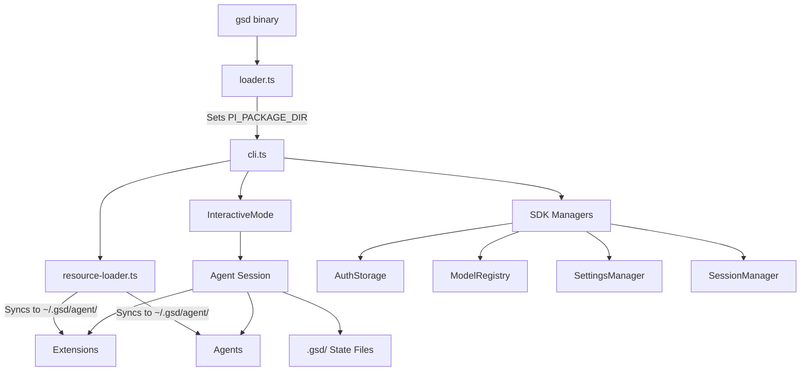

GSD is a TypeScript application that embeds the [Pi SDK](https://github.com/badlogic/pi-mono) coding agent. It's not a prompt framework — it's a standalone CLI with programmatic control over agent sessions, context windows, and execution flow.

## The Stack

```
gsd (CLI binary)
  └─ loader.ts          Sets PI_PACKAGE_DIR, GSD env vars, dynamic-imports cli.ts
      └─ cli.ts         Wires SDK managers, loads extensions, starts InteractiveMode
          ├─ onboarding.ts   First-run setup wizard (LLM provider + tool keys)
          ├─ wizard.ts       Env hydration from stored auth.json credentials
          ├─ app-paths.ts    ~/.gsd/agent/, ~/.gsd/sessions/, auth.json
          ├─ resource-loader.ts  Syncs bundled extensions + agents to ~/.gsd/agent/
          └─ src/resources/
              ├─ extensions/gsd/    Core GSD extension (auto, state, commands, ...)
              ├─ extensions/...     12 supporting extensions
              ├─ agents/            scout, researcher, worker
              ├─ AGENTS.md          Agent routing instructions
              └─ GSD-WORKFLOW.md    Manual bootstrap protocol
```

## Key Components

<CardGroup cols={2}>
  <Card title="Loader + CLI" icon="loader">
    Two-file bootstrap pattern ensures `PI_PACKAGE_DIR` is set before any SDK imports evaluate. See [Loader Pattern](/architecture/loader-pattern).
  </Card>
  <Card title="Resource Sync" icon="sync">
    Always-overwrite sync of bundled extensions and agents to `~/.gsd/agent/` on every launch. Updates ship immediately.
  </Card>
  <Card title="State on Disk" icon="folder">
    `.gsd/` directory is the source of truth. Auto mode reads it, writes it, and advances based on what it finds. No in-memory state survives across sessions.
  </Card>
  <Card title="Extension Ecosystem" icon="puzzle-piece">
    13 bundled extensions provide workflow engine, browser tools, web search, subagents, voice input, and more.
  </Card>
</CardGroup>

## Architecture Diagram

Here's how the pieces fit together:



## Design Decisions

### pkg/ Shim Directory

`PI_PACKAGE_DIR` points to `pkg/` (not project root) to avoid Pi's theme resolution collision with GSD's `src/` directory. The `pkg/` directory contains only:

- `package.json` with `piConfig.name = "gsd"` (branding)
- `dist/modes/interactive/theme/` (Pi's theme assets)

No `src/` directory exists in `pkg/`, so Pi resolves themes via the `dist/` path.

**Why this matters:** Pi's config loader (`config.js`) looks for themes in two places:
1. `${PI_PACKAGE_DIR}/src/modes/interactive/theme/` (if `src/` exists)
2. `${PI_PACKAGE_DIR}/dist/modes/interactive/theme/` (fallback)

If `PI_PACKAGE_DIR` pointed to the GSD project root, Pi would find GSD's `src/` directory and fail to load themes because GSD's `src/` doesn't contain theme assets. The shim directory solves this by isolating only what Pi needs.

### Always-Overwrite Extension Sync

`npm update -g gsd-pi` takes effect immediately. Every launch syncs bundled extensions and agents from `src/resources/` to `~/.gsd/agent/`, overwriting existing files.

**From resource-loader.ts:**

```typescript
export function initResources(agentDir: string): void {
  mkdirSync(agentDir, { recursive: true })

  // Sync extensions — always overwrite so updates land on next launch
  const destExtensions = join(agentDir, 'extensions')
  cpSync(bundledExtensionsDir, destExtensions, { recursive: true, force: true })

  // Sync agents
  const destAgents = join(agentDir, 'agents')
  const srcAgents = join(resourcesDir, 'agents')
  if (existsSync(srcAgents)) {
    cpSync(srcAgents, destAgents, { recursive: true, force: true })
  }

  // Sync skills
  const destSkills = join(agentDir, 'skills')
  const srcSkills = join(resourcesDir, 'skills')
  if (existsSync(srcSkills)) {
    cpSync(srcSkills, destSkills, { recursive: true, force: true })
  }
}
```

User customizations should live in separate subdirectories with unique names, not by editing GSD-managed files.

### State Lives on Disk

The `.gsd/` directory at the project root is the source of truth. Auto mode's state machine reads files, dispatches agents, waits for completion, then reads files again to determine the next action.

**Key state files:**

- `STATE.md` — Dashboard showing current milestone/slice/task and next action
- `DECISIONS.md` — Append-only register of architectural decisions
- `milestones/M001/roadmap.md` — Slice checkboxes indicate completion
- `milestones/M001/slices/S01/plan.md` — Task checkboxes indicate completion
- `milestones/M001/slices/S01/tasks/T01-summary.md` — What happened during a task

No in-memory state survives across sessions. Crash recovery reads surviving session files and synthesizes a recovery briefing from tool calls that made it to disk.

## What v2 Delivers That v1 Couldn't

| Capability | v1 (Prompt Framework) | v2 (Agent Application) |
|---|---|---|
| **Context management** | Hope the LLM doesn't fill up | Fresh session per task, programmatic |
| **Auto mode** | LLM self-loop | State machine reading `.gsd/` files |
| **Crash recovery** | None | Lock files + session forensics |
| **Git strategy** | LLM writes git commands | Programmatic branch-per-slice, squash merge |
| **Cost tracking** | None | Per-unit token/cost ledger with dashboard |
| **Stuck detection** | None | Retry once, then stop with diagnostics |
| **Timeout supervision** | None | Soft/idle/hard timeouts with recovery steering |
| **Context injection** | "Read this file" | Pre-inlined into dispatch prompt |

## Next Steps

<CardGroup cols={2}>
  <Card title="File Structure" href="/architecture/file-structure" icon="folder-tree">
    Where everything lives: `~/.gsd/`, `.gsd/`, and `pkg/`
  </Card>
  <Card title="Loader Pattern" href="/architecture/loader-pattern" icon="code">
    Why PI_PACKAGE_DIR must be set before SDK imports
  </Card>
  <Card title="Pi SDK Integration" href="/architecture/pi-sdk-integration" icon="plug">
    How GSD embeds the Pi coding agent SDK
  </Card>
</CardGroup>
