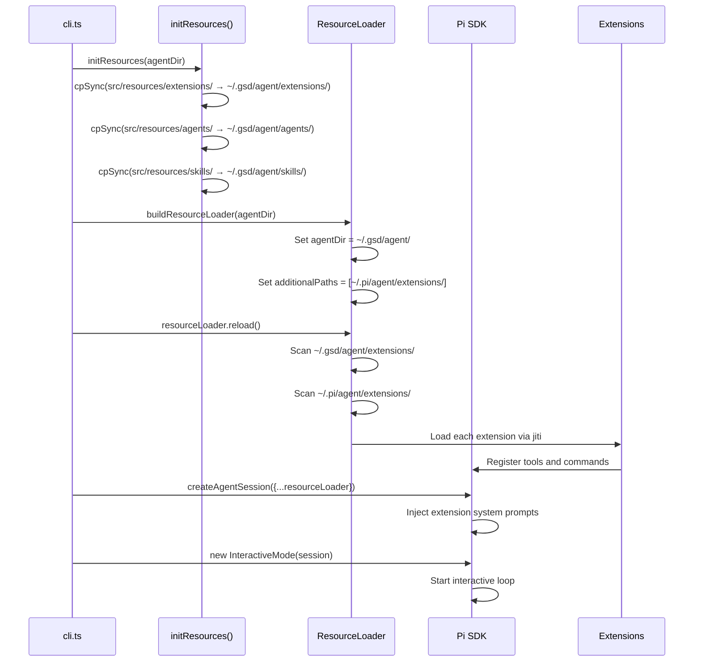

GSD is built on the [Pi SDK](https://github.com/badlogic/pi-mono), a TypeScript framework for building coding agents. This page explains how GSD wires up the SDK and extends it with bundled extensions and agents.

## SDK Manager Wiring

GSD creates an agent session by wiring five SDK managers:

**From cli.ts:**

```typescript
import {
  AuthStorage,
  ModelRegistry,
  SettingsManager,
  SessionManager,
  createAgentSession,
  InteractiveMode,
} from '@mariozechner/pi-coding-agent'

const authStorage = AuthStorage.create(authFilePath)  // ~/.gsd/agent/auth.json
const modelRegistry = new ModelRegistry(authStorage)  // 20+ LLM providers
const settingsManager = SettingsManager.create(agentDir)  // ~/.gsd/agent/settings.json
const sessionManager = SessionManager.create(cwd, projectSessionsDir)  // Per-directory sessions

initResources(agentDir)  // Sync bundled extensions + agents to ~/.gsd/agent/
const resourceLoader = buildResourceLoader(agentDir)  // Load extensions from both ~/.gsd and ~/.pi
await resourceLoader.reload()

const { session, extensionsResult } = await createAgentSession({
  authStorage,
  modelRegistry,
  settingsManager,
  sessionManager,
  resourceLoader,
})

const interactiveMode = new InteractiveMode(session)
await interactiveMode.run()
```

### Manager Responsibilities

<CardGroup cols={2}>
  <Card title="AuthStorage" icon="key">
    Manages encrypted LLM provider credentials and API keys. Stored in `~/.gsd/agent/auth.json`.
  </Card>
  <Card title="ModelRegistry" icon="list">
    Enumerates available models from all configured providers. Supports OAuth (Claude Max, Copilot) and API keys.
  </Card>
  <Card title="SettingsManager" icon="sliders">
    Persists user preferences: default model, scoped models, thinking level, quiet startup, etc.
  </Card>
  <Card title="SessionManager" icon="clock">
    Stores conversation history in `.jsonl` files. Per-directory scoping ensures `/resume` only shows relevant sessions.
  </Card>
  <Card title="ResourceLoader" icon="puzzle-piece">
    Discovers and loads extensions and agents from `~/.gsd/agent/` and `~/.pi/agent/`.
  </Card>
</CardGroup>

## Extension Loading and Syncing

GSD ships with 13 bundled extensions, all synced to `~/.gsd/agent/extensions/` on every launch.

### Always-Overwrite Sync

**From resource-loader.ts:**

```typescript
export function initResources(agentDir: string): void {
  mkdirSync(agentDir, { recursive: true })

  // Sync extensions — always overwrite so updates land on next launch
  const destExtensions = join(agentDir, 'extensions')
  cpSync(bundledExtensionsDir, destExtensions, { recursive: true, force: true })

  // Sync agents
  const destAgents = join(agentDir, 'agents')
  const srcAgents = join(resourcesDir, 'agents')
  if (existsSync(srcAgents)) {
    cpSync(srcAgents, destAgents, { recursive: true, force: true })
  }

  // Sync skills
  const destSkills = join(agentDir, 'skills')
  const srcSkills = join(resourcesDir, 'skills')
  if (existsSync(srcSkills)) {
    cpSync(srcSkills, destSkills, { recursive: true, force: true })
  }
}
```

**Why always-overwrite?** `npm update -g gsd-pi` takes effect immediately. When a user updates GSD, the next launch syncs the new extension code to `~/.gsd/agent/`, replacing the old version.

**User customizations:** Should live in separate subdirectories with unique names (e.g., `~/.gsd/agent/extensions/my-custom-tool/`), not by editing GSD-managed files.

### Dual Extension Path Loading

GSD loads extensions from both `~/.gsd/agent/extensions/` (GSD's default) and `~/.pi/agent/extensions/` (Pi's default). This allows users to use extensions from either location.

**From resource-loader.ts:**

```typescript
export function buildResourceLoader(agentDir: string): DefaultResourceLoader {
  const piAgentDir = join(homedir(), '.pi', 'agent')
  const piExtensionsDir = join(piAgentDir, 'extensions')
  
  return new DefaultResourceLoader({
    agentDir,  // ~/.gsd/agent/
    additionalExtensionPaths: [piExtensionsDir],  // ~/.pi/agent/extensions/
  })
}
```

### Bundled Extensions

GSD ships with these extensions:

| Extension | Purpose |
|-----------|--------|
| **gsd** | Core workflow engine, auto mode, commands, dashboard |
| **bg-shell** | Long-running process management with readiness detection |
| **browser-tools** | Playwright-based browser for UI verification |
| **context7** | Library/framework documentation lookup |
| **search-the-web** | Brave Search, Tavily, or Jina page extraction |
| **subagent** | Delegated tasks with isolated context windows |
| **mac-tools** | macOS native app automation via Accessibility APIs |
| **slash-commands** | Custom command creation |
| **ask-user-questions** | Structured user input with single/multi-select |
| **get-secrets-from-user** | Masked secret collection without manual .env editing |
| **shared** | Shared utilities (imported by other extensions, not an entry point) |

### Extension Entry Points

The loader sets `GSD_BUNDLED_EXTENSION_PATHS` environment variable with colon-joined paths to all bundled extension entry points. This is used by the subagent extension to pass `--extension <path>` to spawned GSD processes.

**From loader.ts:**

```typescript
process.env.GSD_BUNDLED_EXTENSION_PATHS = [
  join(agentDir, 'extensions', 'gsd', 'index.ts'),
  join(agentDir, 'extensions', 'bg-shell', 'index.ts'),
  join(agentDir, 'extensions', 'browser-tools', 'index.ts'),
  join(agentDir, 'extensions', 'context7', 'index.ts'),
  join(agentDir, 'extensions', 'search-the-web', 'index.ts'),
  join(agentDir, 'extensions', 'slash-commands', 'index.ts'),
  join(agentDir, 'extensions', 'subagent', 'index.ts'),
  join(agentDir, 'extensions', 'mac-tools', 'index.ts'),
  join(agentDir, 'extensions', 'ask-user-questions.ts'),
  join(agentDir, 'extensions', 'get-secrets-from-user.ts'),
].join(':')
```

**Note:** `shared/` is NOT included — it's a library imported by other extensions, not an entry point.

## Agent Loading

GSD ships with three specialized subagents:

| Agent | Role |
|-------|------|
| **Scout** | Fast codebase reconnaissance — returns compressed context for handoff |
| **Researcher** | Web research — finds and synthesizes current information |
| **Worker** | General-purpose execution in an isolated context window |

Agents are markdown files synced to `~/.gsd/agent/agents/` on every launch. The subagent extension discovers these files and makes them available for delegation.

**From resource-loader.ts:**

```typescript
const destAgents = join(agentDir, 'agents')
const srcAgents = join(resourcesDir, 'agents')
if (existsSync(srcAgents)) {
  cpSync(srcAgents, destAgents, { recursive: true, force: true })
}
```

### Agent Routing

The bundled `AGENTS.md` file provides routing instructions for when to use each agent. It's synced to `~/.gsd/agent/AGENTS.md` on every launch.

## InteractiveMode Integration

GSD uses Pi SDK's `InteractiveMode` for the interactive CLI experience. This provides:

- Real-time streaming output
- Keyboard shortcuts (Ctrl+P for quick actions, Ctrl+Alt+G for dashboard)
- Model switching
- Session persistence and resume
- Extension tool calling

**From cli.ts:**

```typescript
const interactiveMode = new InteractiveMode(session)
await interactiveMode.run()
```

When InteractiveMode starts, it:

1. Loads the most recent session (if any) for the current directory
2. Injects extension system prompts (from all loaded extensions)
3. Renders the GSD branded header (because `quietStartup` is enabled, and the GSD extension renders its own)
4. Enters the interactive prompt loop

### Print and RPC Modes

GSD also supports non-interactive modes:

**Print mode:** Single-shot execution, outputs text or JSON

```bash
gsd --print "your message"
gsd --mode json "your message"
```

**RPC mode:** JSON-RPC over stdin/stdout (used by subagent)

```bash
gsd --mode rpc
```

These modes skip the TTY check and use `runPrintMode()` or `runRpcMode()` instead of `InteractiveMode`.

**From cli.ts:**

```typescript
if (isPrintMode) {
  const sessionManager = cliFlags.noSession
    ? SessionManager.inMemory()
    : SessionManager.create(process.cwd())

  initResources(agentDir)
  const resourceLoader = new DefaultResourceLoader({
    agentDir,
    additionalExtensionPaths: cliFlags.extensions.length > 0 ? cliFlags.extensions : undefined,
    appendSystemPrompt: cliFlags.appendSystemPrompt,
  })
  await resourceLoader.reload()

  const { session } = await createAgentSession({
    authStorage,
    modelRegistry,
    settingsManager,
    sessionManager,
    resourceLoader,
  })

  if (cliFlags.mode === 'rpc') {
    await runRpcMode(session)
    process.exit(0)
  }

  await runPrintMode(session, {
    mode: cliFlags.mode || 'text',
    messages: cliFlags.messages,
  })
  process.exit(0)
}
```

## State on Disk vs In-Memory

GSD's architecture distinguishes between **SDK state** (in-memory, managed by Pi) and **workflow state** (on disk, managed by the GSD extension).

### SDK State (In-Memory)

- **Conversation history:** Lives in session manager, persisted to `.jsonl` files in `~/.gsd/sessions/`
- **Model selection:** Stored in settings manager, persisted to `~/.gsd/agent/settings.json`
- **Auth tokens:** Stored in auth storage, persisted to `~/.gsd/agent/auth.json`

These survive across sessions because they're saved to disk, but they're managed by SDK components.

### Workflow State (On Disk)

- **Milestone/slice/task state:** Lives in `.gsd/` at project root
- **Summaries and plans:** Markdown files on disk
- **Checkboxes and progress:** Parsed from markdown

Auto mode reads these files to determine what to do next, dispatches an agent, waits for completion, then reads them again. No in-memory workflow state survives across sessions.

**This separation is intentional:** SDK state is fine in-memory (with disk persistence for continuity). Workflow state must live on disk so auto mode can be stopped, inspected, and resumed from anywhere.

## Extension Lifecycle Flow



## Summary

<CardGroup cols={2}>
  <Card title="Manager Wiring" icon="diagram-project">
    Five SDK managers (AuthStorage, ModelRegistry, SettingsManager, SessionManager, ResourceLoader) provide credentials, models, preferences, sessions, and extensions.
  </Card>
  <Card title="Extension Sync" icon="sync">
    Always-overwrite sync from `src/resources/` to `~/.gsd/agent/` on every launch ensures updates ship immediately.
  </Card>
  <Card title="Dual Path Loading" icon="folder-tree">
    Extensions load from both `~/.gsd/agent/extensions/` and `~/.pi/agent/extensions/` for compatibility.
  </Card>
  <Card title="State Separation" icon="database">
    SDK state (conversation, auth, settings) lives in-memory with disk persistence. Workflow state (milestones, slices, tasks) lives on disk in `.gsd/`.
  </Card>
</CardGroup>

## Next Steps

<CardGroup cols={2}>
  <Card title="File Structure" href="/architecture/file-structure" icon="folder-tree">
    Where everything lives: ~/.gsd/, .gsd/, and pkg/
  </Card>
  <Card title="Loader Pattern" href="/architecture/loader-pattern" icon="code">
    Why PI_PACKAGE_DIR must be set before SDK imports
  </Card>
</CardGroup>
