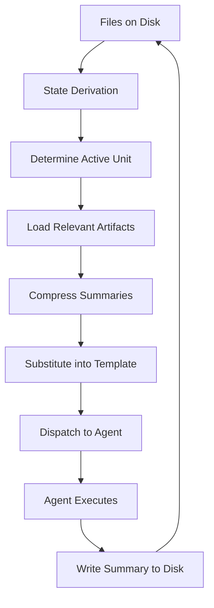

## The Problem

LLMs have finite context windows. When you ask an agent to work on a large project:

- It wastes tool calls reading files to orient itself
- It accumulates garbage from prior tasks, degrading quality
- It forgets important context from earlier in the session
- It re-reads the same files multiple times

GSD solves this through **context engineering** — programmatically constructing dispatch prompts that include exactly what the agent needs, nothing more, nothing less.

## Fresh Context Per Task

In auto mode, each task gets a **fresh context window**. No accumulated history, no prior task debris, no "I'll be more concise now" degradation.

Between tasks:
1. Prior session ends
2. Task summary is written to disk
3. New session starts
4. Dispatch prompt is constructed with relevant context
5. Agent executes with clean slate

This is only possible because GSD controls the agent harness directly (via the Pi SDK). It's not an LLM calling itself in a loop — it's TypeScript starting new sessions.

## The Dispatch Prompt

When GSD dispatches a task, it constructs a prompt by:

1. Loading the prompt template (e.g., `execute-task.md`)
2. Gathering context artifacts from disk
3. Inlining the context into template variables
4. Substituting variables to produce the final prompt

From `prompt-loader.ts`:

```typescript
export function loadPrompt(
  name: string, 
  vars: Record<string, string>
): string {
  const path = join(promptsDir, `${name}.md`);
  let content = readFileSync(path, "utf-8");
  
  for (const [key, value] of Object.entries(vars)) {
    content = content.replaceAll(`{{${key}}}`, value);
  }
  
  return content.trim();
}
```

### Example Dispatch

For task T02 in slice S01 of milestone M001:

```markdown
You are executing GSD auto-mode.

## UNIT: Execute Task T02 ("Login and Signup Endpoints") — Slice S01 ("JWT Authentication Flow"), Milestone M001

Start with the inlined context below.

### Task Plan

# T02: Login and Signup Endpoints

**Slice:** S01 — JWT Authentication Flow
**Milestone:** M001

## Description
Build POST endpoints for /api/auth/login and /api/auth/signup that
validate credentials, hash passwords, and return JWT tokens.

## Steps
1. Create route handlers for login and signup
2. Integrate with auth.ts token generation from T01
3. Add password hashing with bcrypt
4. Validate request bodies with Zod
5. Return appropriate error codes

## Must-Haves
- [ ] File api/auth/login/route.ts exists (min 20 lines)
- [ ] File api/auth/signup/route.ts exists (min 30 lines)
- [ ] Login returns JWT token for valid credentials
- [ ] Signup creates user and returns JWT token
- [ ] Invalid credentials return 401

### Prior Task: T01

**JWT token generation with jose library**

Implemented generateToken() and verifyToken() in src/lib/auth.ts.
Tokens signed with HS256, 7-day expiry. Secret validated at load.

Key exports:
- generateToken(userId: string): Promise<string>
- verifyToken(token: string): Promise<{userId: string} | null>

### Slice Plan Excerpt

**Goal:** User can authenticate and receive a session token

**Demo:** POST to /api/auth/login returns a working JWT token

**Must-Haves:**
- User can sign up with email and password
- User can log in and receive a JWT token
- Invalid credentials are rejected properly

### Backing Source Artifacts
- Slice plan: `.gsd/milestones/M001/slices/S01/PLAN.md`
- Task plan source: `.gsd/milestones/M001/slices/S01/tasks/T02-PLAN.md`
- Prior task summaries in this slice:
  - `.gsd/milestones/M001/slices/S01/tasks/T01-SUMMARY.md`

Then:
1. Execute the steps in the inlined task plan
2. Build the real thing (no stubs)
3. Verify must-haves are met
4. Write `.gsd/milestones/M001/slices/S01/tasks/T02-SUMMARY.md`
5. Mark T02 done in `.gsd/milestones/M001/slices/S01/PLAN.md`

When done, say: "Task T02 complete."
```

The agent starts with everything it needs. No file reading. No orientation overhead.

## What Gets Injected

GSD injects different context depending on the phase:

<Tabs>
  <Tab title="Execute Task">
    - Task plan (full)
    - Slice plan excerpt (goal, demo, must-haves)
    - Prior task summaries from this slice
    - Dependency slice summaries (if slice depends on others)
    - Relevant decisions from DECISIONS.md
    - Boundary map contracts for this slice
    - File paths to source artifacts
  </Tab>
  <Tab title="Plan Slice">
    - Slice entry from roadmap (title, demo, dependencies)
    - Boundary map section for this slice
    - Milestone context (if exists)
    - Slice-level research (if exists)
    - Dependency slice summaries
    - Relevant decisions from DECISIONS.md
  </Tab>
  <Tab title="Research Slice">
    - Slice entry from roadmap
    - Milestone context (if exists)
    - Existing research from milestone (if exists)
    - Relevant decisions from DECISIONS.md
  </Tab>
  <Tab title="Complete Slice">
    - All task summaries from this slice
    - Slice plan (goal, demo, must-haves)
    - Roadmap entry for this slice
  </Tab>
</Tabs>

## Summary Compression

As work progresses, summaries accumulate. To keep context manageable, GSD uses **hierarchical compression**:

### Task Summaries

Each task produces a summary with YAML frontmatter:

```yaml
---
id: T01
parent: S01
milestone: M001
provides:
  - JWT token generation with jose library
  - Token verification with expiry validation
  - Environment-based secret loading
requires:
  - slice: S00
    provides: Project setup with Next.js
affects: [S02, S03]
key_files:
  - src/lib/auth.ts
key_decisions:
  - "Use jose instead of jsonwebtoken (better TypeScript support)"
patterns_established:
  - "Environment variable validation at module load time"
duration: 15min
verification_result: pass
---
```

The frontmatter is **dense, structured, and scannable**. Future tasks can quickly determine:
- What this task built (`provides`)
- What it needed (`requires`)
- What files it touched (`key_files`)
- What decisions it made (`key_decisions`)

### Slice Summaries

When a slice completes, GSD compresses all task summaries into a single slice summary:

```markdown
---
id: S01
milestone: M001
provides:
  - JWT authentication with jose library
  - Login and signup endpoints
  - Session middleware with token validation
  - Password hashing with bcrypt
  - Request validation with Zod
requires: []
affects: [S02, S03, S04]
key_files:
  - src/lib/auth.ts
  - src/app/api/auth/login/route.ts
  - src/app/api/auth/signup/route.ts
  - src/middleware.ts
key_decisions:
  - "JWT tokens in Authorization header (mobile compatibility)"
  - "7-day token expiry with refresh rotation"
patterns_established:
  - "Environment variable validation at module load"
  - "Zod validation for all API inputs"
drill_down_paths:
  - .gsd/milestones/M001/slices/S01/tasks/T01-SUMMARY.md
  - .gsd/milestones/M001/slices/S01/tasks/T02-SUMMARY.md
  - .gsd/milestones/M001/slices/S01/tasks/T03-SUMMARY.md
duration: 2h
completed_at: 2026-03-07T18:00:00Z
---

# S01: JWT Authentication Flow

**Complete JWT auth with login/signup endpoints and session middleware**

## What Happened

Built JWT authentication from scratch using jose library. Users can
sign up, log in, and access protected routes with token validation.
All endpoints validate inputs with Zod. Passwords hashed with bcrypt.

## Demo Verification

✅ User can sign up and receive JWT token
✅ User can log in with valid credentials
✅ Protected routes reject requests without valid tokens
✅ Invalid credentials return 401

## Files Created/Modified

- `src/lib/auth.ts` — JWT generation and verification
- `src/app/api/auth/login/route.ts` — Login endpoint
- `src/app/api/auth/signup/route.ts` — Signup endpoint  
- `src/middleware.ts` — Session validation middleware
```

### Milestone Summaries

Milestone summaries compress all slice summaries. They're updated incrementally as each slice completes:

```markdown
---
id: M001
provides:
  - Complete user authentication system
  - Project CRUD operations
  - Dashboard with project listing
slices_completed: 3
slices_total: 5
key_decisions:
  - "JWT tokens in Authorization header"
  - "PostgreSQL with Prisma ORM"
  - "Next.js 14 App Router"
patterns_established:
  - "Zod validation for all API inputs"
  - "Middleware-based auth checks"
---

# M001: User Authentication and Projects

**Users can authenticate and manage projects through a web interface**

## Completed Slices

### S01: JWT Authentication Flow (2h)
Complete JWT auth system. Users can sign up, log in, and access
protected routes with token validation.

### S02: User Registration UI (1.5h)
Signup form with validation, email confirmation flow, and error handling.

### S03: Project CRUD Operations (2.5h)
Database schema, project creation/listing endpoints, dashboard page.

## Remaining Work

- S04: Project detail pages
- S05: Project settings and deletion
```

## Context Budget Management

GSD aims to keep injected context under **~2500 tokens** per dispatch.

### Strategy: Load the Highest Level First

When planning or executing a task:

1. Start with **milestone summary** (if it exists)
2. Only drill down to **slice summaries** if you need specific detail
3. Only read **task summaries** if you need implementation-level context
4. If the dependency chain is too large, **drop the oldest/least-relevant summaries first**

From the GSD-WORKFLOW.md:

> When planning or executing a task, load relevant prior context:
>
> 1. Check the current slice's `depends:[]` in `roadmap.md`.
> 2. Load summaries from those dependency slices.
> 3. Start with the **highest available level** — milestone `summary.md` first.
> 4. Only drill down to slice/task summaries if you need specific detail.
> 5. Stay within **~2500 tokens** of total injected summary context.

### Soft Caps

Summary frontmatter has soft caps:

- ~5 items in `provides`
- ~10 items in `key_files`
- ~5 items in `key_decisions`
- ~3 items in `patterns_established`

Exceed these when genuinely needed, but don't let summaries become essays.

## The Context Pipeline

Here's the full flow from files to dispatch:



### Step-by-Step

1. **State Derivation** (`state.ts`)
   - Scan `.gsd/milestones/` directories
   - Parse `ROADMAP.md` files
   - Identify active milestone, slice, task
   - Determine phase (planning, executing, completing, reassessing)

2. **Load Relevant Artifacts**
   - Read task plan
   - Read slice plan excerpt
   - Read prior task summaries from this slice
   - Read dependency slice summaries
   - Read relevant entries from `DECISIONS.md`
   - Read boundary map contracts

3. **Compress Summaries**
   - Parse YAML frontmatter from summaries
   - Extract `provides`, `key_files`, `key_decisions`
   - If total context exceeds budget, prioritize recent/relevant

4. **Substitute into Template** (`prompt-loader.ts`)
   - Load prompt template (e.g., `execute-task.md`)
   - Replace `{{taskId}}`, `{{taskTitle}}`, etc.
   - Inline task plan, slice excerpt, summaries
   - Produce final prompt

5. **Dispatch to Agent**
   - Create fresh session
   - Inject final prompt
   - Agent starts with full context, zero file reads

## Why This Works

### Comparison: Traditional Agent Session

```
User: "Work on the login feature"
Agent: "Let me read the project structure..."
  [reads 5 files]
Agent: "Let me understand the authentication approach..."
  [reads 3 more files]
Agent: "Let me check what was done in prior tasks..."
  [reads 2 summary files]
Agent: "Now I'll implement..."
  [finally starts work, 15% of context used for orientation]
```

### GSD Dispatch

```
GSD constructs prompt:
  - Task plan: T02 (login endpoints)
  - Prior work: T01 built auth.ts with generateToken()
  - Slice goal: User can authenticate
  - Boundary map: Must export POST handlers
  
Agent receives prompt:
  "You're executing T02. Here's what T01 built:
   generateToken() and verifyToken() in src/lib/auth.ts.
   Now implement login and signup endpoints."
   
Agent: [starts implementing immediately]
  [100% of context used for execution]
```

### Benefits

<CardGroup cols={2}>
  <Card title="Zero Orientation Overhead" icon="bolt">
    Agent starts with full context, no file reading, no "let me understand the codebase" preamble.
  </Card>
  <Card title="Fresh Context Windows" icon="sparkles">
    No accumulated garbage. Every task gets a clean 200k-token window.
  </Card>
  <Card title="Deterministic Context" icon="chart-line">
    Same task, same context, every time. No variation based on session history.
  </Card>
  <Card title="Compressed Summaries" icon="compress">
    Dense YAML frontmatter conveys maximum information per token.
  </Card>
</CardGroup>

## Practical Example

Here's a real dispatch for a task late in a milestone:

**Context Budget:**
- Task plan: ~400 tokens
- Slice plan excerpt: ~200 tokens
- Prior task summaries (2 tasks in this slice): ~300 tokens
- Dependency slice summary (S01): ~250 tokens
- Boundary map excerpt: ~150 tokens
- Relevant decisions (3 entries): ~200 tokens
- Template instructions: ~300 tokens

**Total: ~1800 tokens** — well under the 2500 token budget.

**Agent receives:**
- Exactly what it needs to execute
- No extraneous history
- No need to read files
- Clear expectations (must-haves, verification steps)

Result: Task completes in 20 minutes with no wasted context.

## Anti-Patterns

<Warning>
**Don't inject everything** — More context isn't always better. Irrelevant summaries waste tokens and distract the agent.
</Warning>

<Warning>
**Don't rely on the agent to read files** — If the agent needs it, inline it. Reading files mid-task is a code smell.
</Warning>

<Warning>
**Don't accumulate session history** — Fresh context per task prevents quality degradation.
</Warning>

## Key Takeaway

Context engineering isn't about giving the LLM more information — it's about giving it **exactly the right information** at **exactly the right time** in a **fresh context window**.

GSD achieves this by:
1. Controlling the agent harness directly (not prompting an existing assistant)
2. Deriving state from files (not memory)
3. Compressing summaries hierarchically (dense YAML frontmatter)
4. Inlining context into dispatch prompts (no file reading)
5. Starting fresh sessions per task (no accumulated garbage)

This is only possible because GSD is a **TypeScript application that controls the agent**, not a prompt framework.