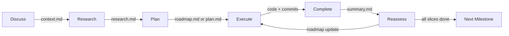

## Overview

GSD work flows through a state machine. Each phase produces a file artifact and transitions to the next phase automatically.



The state machine operates at two levels:
- **Milestone level:** Discuss → Research → Plan (roadmap) → Execute slices → Complete milestone
- **Slice level:** Discuss → Research → Plan (tasks) → Execute tasks → Complete slice → Reassess roadmap

## Phase 1: Discuss (Optional)

**Purpose:** Capture user decisions on gray areas before planning.

**Produces:** `CONTEXT.md` at milestone or slice level.

**When to use:** When the scope has ambiguities the user should weigh in on.

**When to skip:** When the user already knows exactly what they want, or when you're told to "just go."

### What Happens

1. Read the vision or slice description
2. Identify 3-5 gray areas — implementation decisions the user cares about
3. Use structured questions to discuss each area
4. Write decisions to `CONTEXT.md`
5. **Do NOT discuss how to implement** — only what the user wants

### Example: Milestone Discuss

**Input:** Project vision for a user authentication system

**Questions asked:**
- Should we use JWT tokens or session cookies?
- Do we need social login (Google, GitHub) in this milestone?
- Should email confirmation be required or optional?
- What happens if a user forgets their password?

**Output:** `M001-CONTEXT.md`

```markdown
# M001: User Authentication — Context

**Gathered:** 2026-03-07
**Status:** Ready for planning

## Implementation Decisions
- **Auth mechanism:** JWT tokens in Authorization header (user has mobile plans)
- **Social login:** Deferred to M002 (email/password only for M001)
- **Email confirmation:** Required (security requirement)
- **Password reset:** Basic email-based flow (no SMS)

## Agent's Discretion
- Token expiry duration (suggest 7 days with refresh)
- Specific JWT library (jose, jsonwebtoken, or Auth.js)
- Database schema details for users table

## Deferred Ideas
- Two-factor authentication → M003
- Magic link login → M003
- Session device management → M004
```

### When to Run Discuss

<CardGroup cols={2}>
  <Card title="Run Discuss" icon="comments">
    - Multiple reasonable implementation paths exist
    - User has strong preferences or constraints
    - Trade-offs need human judgment
    - Scope boundaries are unclear
  </Card>
  <Card title="Skip Discuss" icon="forward">
    - Requirements are crystal clear
    - User said "just build it"
    - You're implementing a well-defined spec
    - Decisions are purely technical (agent can decide)
  </Card>
</CardGroup>

## Phase 2: Research (Optional)

**Purpose:** Scout the codebase and relevant docs before planning.

**Produces:** `RESEARCH.md` at milestone or slice level.

**When to use:** When working in unfamiliar code, with unfamiliar libraries, or on complex integrations.

**When to skip:** When the codebase is familiar and the work is straightforward.

### What Happens

1. Read `CONTEXT.md` if it exists — know what decisions are locked
2. Scout relevant code: search for existing patterns, read key files
3. Use library documentation tools if needed
4. Write findings to `RESEARCH.md` with specific sections

### Research Output Structure

From the GSD-WORKFLOW.md:

```markdown
# S01: Stripe Integration — Research

**Researched:** 2026-03-07
**Domain:** Payment processing / Stripe API
**Confidence:** HIGH

## Summary
Stripe SDK handles webhooks, idempotency, and retry logic.
Use `@stripe/stripe-js` for client-side, `stripe` for server.
Webhooks require HTTPS endpoint and signature verification.

## Don't Hand-Roll
| Problem | Don't Build | Use Instead | Why |
|---------|-------------|-------------|-----|
| Webhook verification | Custom signature check | stripe.webhooks.constructEvent() | Timing-attack safe |
| Payment retries | Manual retry logic | Stripe's built-in retry | Already handles edge cases |
| PCI compliance | Custom card storage | Stripe Elements | Reduces compliance scope |

## Common Pitfalls

### Pitfall 1: Testing with live keys in development
**What goes wrong:** Real charges during testing
**Why it happens:** Easy to mix up test/live keys
**How to avoid:** Environment-specific key loading with validation
**Warning signs:** Unexpected balance changes in Stripe dashboard

### Pitfall 2: Not handling webhook retries
**What goes wrong:** Duplicate order processing
**Why it happens:** Stripe retries failed webhooks
**How to avoid:** Idempotency keys and status checks
**Warning signs:** Multiple success emails per payment

## Relevant Code
- Existing: `src/lib/payments/` has PayPal integration (similar pattern)
- Reusable: `src/lib/webhooks/verify.ts` for signature validation
- Integration point: `src/app/api/checkout/` needs webhook handler

## Sources
- Context7: stripe/stripe-node — webhooks, events, retries (HIGH confidence)
- Stripe docs: webhook signature verification (HIGH confidence)
- Existing codebase: PayPal integration patterns (VERIFIED)
```

### The "Don't Hand-Roll" Section

This is the most valuable part of research. It prevents expensive mistakes by identifying problems that look simple but have robust existing solutions.

**Example from real projects:**

| Problem | Don't Build | Use Instead | Why |
|---------|-------------|-------------|-----|
| Date parsing | Regex for ISO dates | date-fns or Temporal | Timezones, DST, leap seconds |
| Password hashing | SHA-256 + salt | bcrypt or argon2 | Timing attacks, GPU resistance |
| SQL queries | String concatenation | Parameterized queries | SQL injection |
| JWT validation | Manual decode + verify | Library with timing-safe compare | Timing attacks |

## Phase 3: Plan

**Purpose:** Decompose work into verifiable units with must-haves.

**Produces:** 
- For milestones: `ROADMAP.md`
- For slices: `PLAN.md` + individual `TNN-PLAN.md` files

### Milestone Planning

1. Read `CONTEXT.md`, `RESEARCH.md`, and `.gsd/DECISIONS.md` if they exist
2. Decompose the vision into 4-10 demoable vertical slices
3. Order by risk (high-risk first)
4. Write `ROADMAP.md` with checkboxes, risk levels, dependencies, demo sentences
5. **Write the boundary map** — specify what each slice produces and consumes

### Slice Planning

1. Read the slice's entry in `ROADMAP.md` and its boundary map section
2. Read `CONTEXT.md`, `RESEARCH.md`, and `.gsd/DECISIONS.md` if they exist
3. Read summaries from dependency slices (check `depends:[]` in roadmap)
4. Verify upstream slices' outputs match what this slice expects to consume
5. Decompose into 1-7 tasks, each fitting one context window
6. Each task needs: title, description, steps, must-haves
7. Must-haves should reference boundary map contracts
8. Write `PLAN.md` and individual `TNN-PLAN.md` files

### The Boundary Map

The boundary map is a planning artifact that forces interface thinking before implementation:

```markdown
## Boundary Map

### S01 → S02
Produces:
  types.ts → User, Session, AuthToken (interfaces)
  auth.ts  → generateToken(), verifyToken(), refreshToken()

Consumes: nothing (leaf node)

### S02 → S03
Produces:
  api/auth/login.ts  → POST handler
  api/auth/signup.ts → POST handler
  middleware.ts       → authMiddleware()

Consumes from S01:
  auth.ts → generateToken(), verifyToken()
```

This enables:
- Upfront thinking about slice boundaries
- Concrete targets for downstream slices
- Deterministic verification that slices actually connect

## Phase 4: Execute

**Purpose:** Do the work for one task.

**Produces:** Code changes + verification results.

### What Happens

1. Read the task's `TNN-PLAN.md`
2. Read relevant summaries from prior tasks
3. Execute each step
4. If you make an architectural decision, append to `.gsd/DECISIONS.md`
5. Verify the must-haves are actually met
6. Write the task summary
7. Mark the task done in `PLAN.md`

### Fresh Context Per Task

In auto mode, each task execution gets a **fresh context window**. The dispatch prompt includes:

- Task plan (inlined)
- Slice plan excerpt
- Prior task summaries from this slice
- Dependency slice summaries
- Relevant decisions from `DECISIONS.md`
- Boundary map contracts for this slice

The agent doesn't waste tool calls reading these files — they're pre-loaded into the prompt.

### Execution Rules

From `execute-task.md`:

1. **Build the real thing** — not stubs, not mocks, not hardcoded responses
2. **Write tests as part of execution** — tests are verification, not an afterthought
3. **Add observability for non-trivial runtime behavior** — async flows, API boundaries, error paths
4. **Verify must-haves** by running concrete checks
5. **If execution reveals the plan is wrong:** Set `blocker_discovered: true` in the task summary

### The "Build Real Things" Rule

Task plans say "create login endpoint." What does the agent build?

❌ **Wrong:**
```typescript
export async function POST(request: Request) {
  // TODO: implement
  return Response.json({ success: true });
}
```

✅ **Right:**
```typescript
export async function POST(request: Request) {
  const { email, password } = await request.json();
  const user = await db.users.findUnique({ where: { email } });
  if (!user || !await bcrypt.compare(password, user.passwordHash)) {
    return Response.json({ error: 'Invalid credentials' }, { status: 401 });
  }
  const token = generateToken(user.id);
  return Response.json({ token, user });
}
```

## Phase 5: Complete

**Purpose:** Summarize what happened and mark work done.

**Produces:** 
- For tasks: `TNN-SUMMARY.md`
- For slices: `SUMMARY.md` + `UAT.md`
- For milestones: Updated `SUMMARY.md`

### Task Completion

1. Write task summary with YAML frontmatter
2. Mark task done in `PLAN.md` (checkbox)
3. Auto-commit changes to slice branch

### Slice Completion

When all tasks in a slice are done:

1. Write slice `SUMMARY.md` (compresses all task summaries)
2. Write slice `UAT.md` — non-blocking human test script
3. Mark slice checkbox in `ROADMAP.md` as `[x]`
4. Squash merge slice branch to `main`
5. Update milestone `SUMMARY.md` with completed slice
6. Proceed to Reassess phase

### Task Summary Format

From the GSD-WORKFLOW.md:

```markdown
---
id: T01
parent: S01
milestone: M001
provides:
  - JWT token generation with jose library
  - Token verification with expiry validation
  - Environment-based secret loading
requires:
  - slice: S00
    provides: Project setup with Next.js
affects: [S02, S03]
key_files:
  - src/lib/auth.ts
key_decisions:
  - "Use jose instead of jsonwebtoken (better TypeScript support)"
patterns_established:
  - "Environment variable validation at module load time"
drill_down_paths:
  - .gsd/milestones/M001/slices/S01/tasks/T01-PLAN.md
duration: 15min
verification_result: pass
completed_at: 2026-03-07T16:00:00Z
---

# T01: JWT Authentication Helpers

**JWT token lifecycle with jose library and secure secret handling**

## What Happened

Implemented generateToken() and verifyToken() using jose library.
Tokens include userId, expiry (7d default), and are signed with
HS256 using JWT_SECRET from env. Added validation to ensure secret
exists and has minimum length (32 bytes) at module load.

## Deviations

None. Plan was accurate.

## Files Created/Modified
- `src/lib/auth.ts` — JWT generation and verification
- `src/lib/env.ts` — Environment variable validation
- `tests/auth.test.ts` — Token lifecycle tests
```

The one-liner must be **substantive**: "JWT auth with refresh rotation using jose" not "Authentication implemented."

## Phase 6: Reassess

**Purpose:** Check if the roadmap still makes sense given what was learned.

**Produces:** Updated `ROADMAP.md` or decision to continue as planned.

### What Happens

After each slice completes, GSD runs reassessment:

1. Read the completed slice summary
2. Review the remaining slices in the roadmap
3. Ask: **"Did this slice reveal information that invalidates the plan?"**
4. If yes: reorder, add, remove, or modify slices
5. If no: continue to next slice

### When Reassessment Triggers Changes

<CardGroup cols={2}>
  <Card title="Reorder Slices" icon="arrows-up-down">
    **When:** A low-risk slice turned out to be high-risk
    
    **Action:** Move it earlier to validate sooner
    
    **Example:** "Database migrations were harder than expected, move S05 before S03"
  </Card>
  <Card title="Add Slices" icon="plus">
    **When:** Work revealed a missing capability
    
    **Action:** Insert new slice with correct dependencies
    
    **Example:** "Need rate limiting before exposing API (add S02.5)"
  </Card>
  <Card title="Remove Slices" icon="minus">
    **When:** Slice became unnecessary
    
    **Action:** Delete it and update dependencies
    
    **Example:** "Library handles caching, remove S04"
  </Card>
  <Card title="Modify Slices" icon="pen">
    **When:** Scope changed but slice is still needed
    
    **Action:** Update title, demo, and boundary map
    
    **Example:** "Webhook signature validation now required in S02"
  </Card>
</CardGroup>

### Reassessment Anti-Patterns

❌ **Don't reassess because of bugs** — fix bugs in the current slice or next task

❌ **Don't reassess because you want to add "nice-to-haves"** — defer to next milestone

❌ **Don't reassess after every task** — only after slice completion

✅ **Do reassess when a fundamental assumption was wrong** — library doesn't support X, API changed, architecture needs rethinking

## State Derivation

GSD's state is derived from files on disk, not stored in memory.

### Source of Truth

`STATE.md` is a **derived cache**, not the source of truth.

**Real sources of truth:**
- `ROADMAP.md` → which slices exist and which are done
- `PLAN.md` → which tasks exist within a slice
- `TNN-SUMMARY.md` → what happened during a task
- `SUMMARY.md` → compressed outcomes

### How State is Derived

From `state.ts`:

1. Scan `.gsd/milestones/` for milestone directories
2. For each milestone, read `ROADMAP.md`
3. Find the first incomplete milestone → active milestone
4. Read that milestone's `ROADMAP.md` to find slices
5. Find the first incomplete slice → active slice
6. Read that slice's `PLAN.md` to find tasks
7. Find the first incomplete task → active task

### Phase Determination

```typescript
if (!roadmap exists) {
  phase = 'planning-milestone';
} else if (!slice plan exists) {
  phase = 'planning-slice';
} else if (active task exists) {
  phase = 'executing-task';
} else if (slice not complete) {
  phase = 'completing-slice';
} else if (more slices exist) {
  phase = 'reassessing-roadmap';
} else {
  phase = 'completing-milestone';
}
```

## Resumability

Because state is derived from files, GSD can resume at any point:

- **Mid-task:** Read `PLAN.md`, see which task is unmarked, read its plan, continue
- **Mid-slice:** Read `PLAN.md`, see which tasks are done, continue with next task
- **Mid-milestone:** Read `ROADMAP.md`, see which slices are done, continue with next slice
- **After crash:** Read `STATE.md`, or re-derive from files if `STATE.md` is stale

No session state. No in-memory tracking. Just files.

## Practical Example

Here's a slice flowing through all phases:

1. **Discuss:** User decides on JWT tokens, email confirmation required
2. **Research:** Found `jose` library, existing PayPal integration has similar patterns
3. **Plan:** Decomposed into 3 tasks (token helpers, endpoints, middleware)
4. **Execute T01:** Built token helpers, tests pass, marked done
5. **Execute T02:** Built login/signup endpoints, integrated with T01 output
6. **Execute T03:** Built middleware, verified end-to-end flow works
7. **Complete:** Wrote slice summary, UAT script, squash merged to main
8. **Reassess:** Remaining slices still valid, continue to S02

Total time: ~2 hours. Fresh context per task. No manual orchestration.